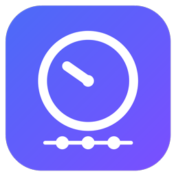
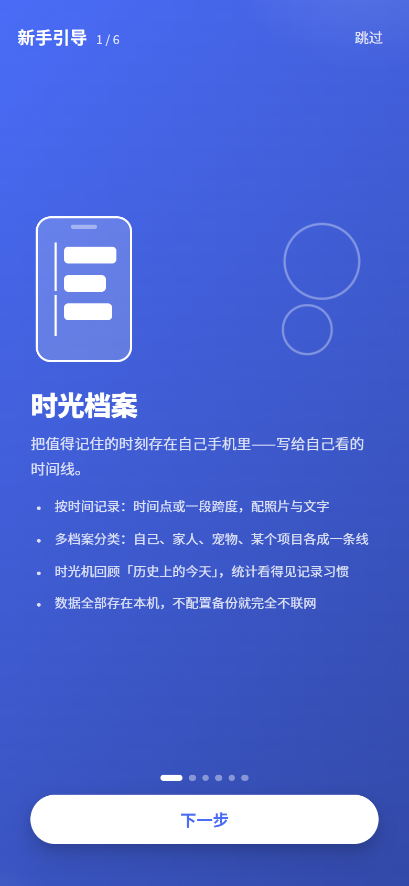
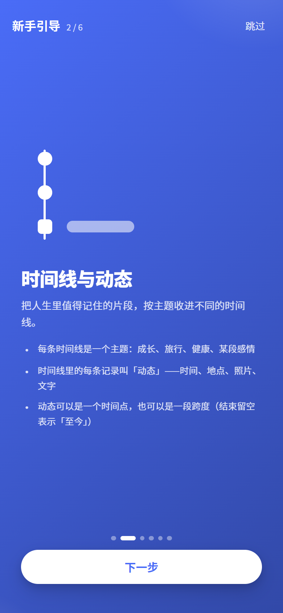
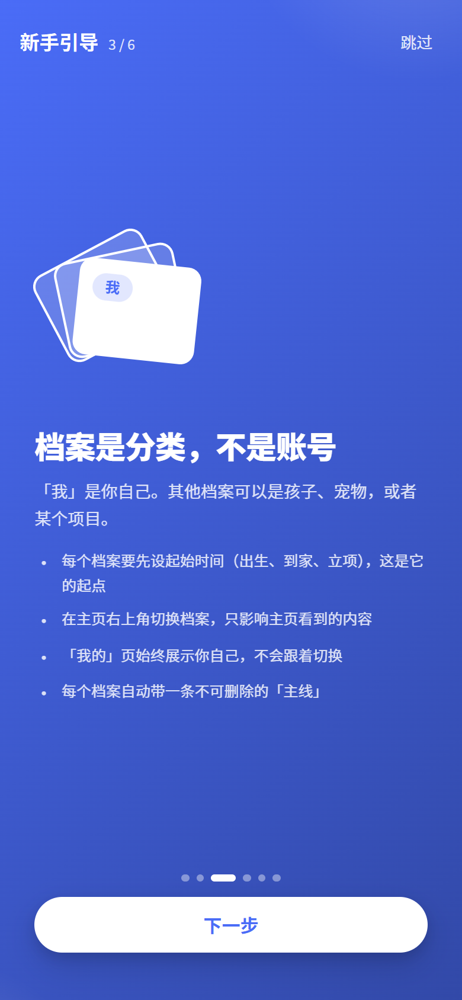
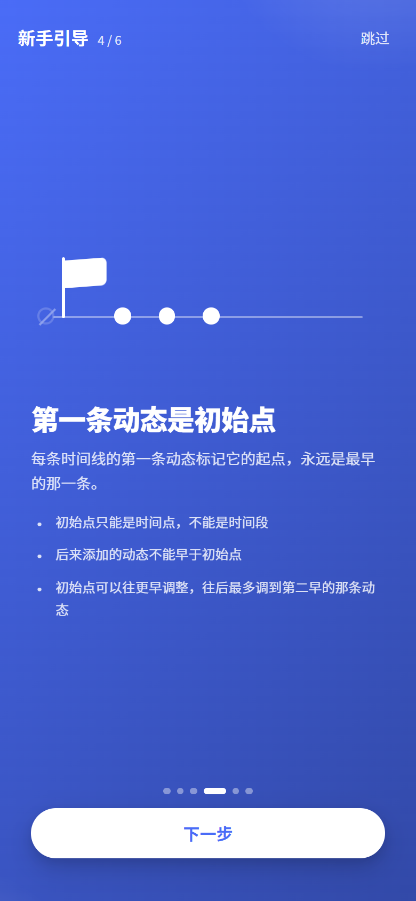
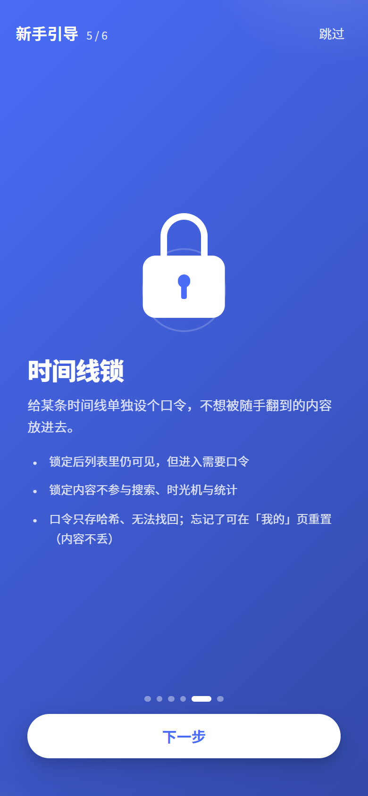
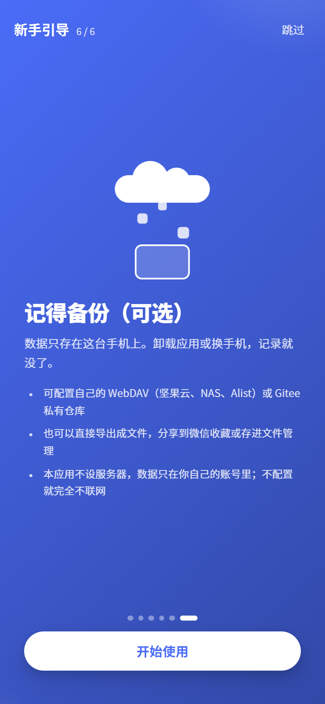
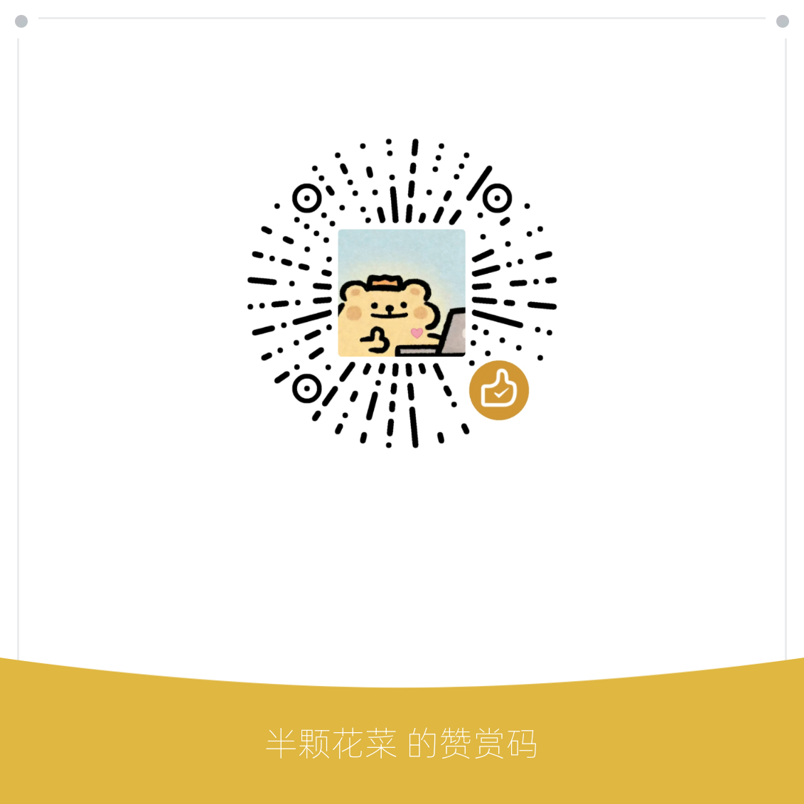

# 时光档案

**把值得记住的时刻，存在自己的手机里**

一个不联网也能用、没有账号、没有服务器的安卓时间线记录 App

  
  
  
  

### 📥 获取安装包

微信搜一搜「**半颗花菜**」，发送「**时光档案**」即可拿到下载链接

每版改了什么：<a href="CHANGELOG.md">更新日志</a> · 遇到问题：<a href="../../issues/new/choose">提个 Issue</a>

---

## 这是什么

你有多少事情，当时觉得一定不会忘，后来还是想不起具体哪一天？

时光档案就是用来存这些的。按时间记下一件事——发生在哪天、在哪儿、当时拍的照片、想说的话——然后它们会自己排成一条线。往回翻的时候，你看到的不是一堆散落的照片，而是一段能读下去的经历。

它刻意做得很简单：**没有账号，不用注册，装上就能用。所有内容存在你自己的手机里，App 本身没有服务器，也不会把任何东西传出去**。

---

## 能用它记什么

| | |
| --- | --- |
| 🧍 **自己** | 换工作、搬家、体检指标、戒掉某个习惯的第 N 天 |
| 👶 **孩子** | 第一次翻身、第一次叫爸爸、每年的身高体重 |
| 🐱 **宠物** | 到家那天、疫苗记录、生病与康复 |
| 🌱 **一件正在做的事** | 装修、备考、健身、写一本书 |
| 💐 **一段关系** | 认识、在一起、结婚纪念 |

这些在 App 里各自是一个「**档案**」。档案是分类，不是账号——你一个人可以同时管着自己、孩子和猫的三条线。

---

## 主要功能

### 📝 记一条动态

一条记录（App 里叫「**动态**」）可以包含：

- **时间**：某一天，也可以精确到时、分、秒；不确定就只填日期
- **一段时间**：比如「2015 年 9 月 ~ 2019 年 6 月」读大学，结束留空就是「至今」
- **地点**：写自己看得懂的名字（「外婆家」「公司楼下」）
- **照片**：最多 9 张，自动压缩后存进 App 私有目录；可指定其中一张作封面
- **标题和描述**：当时想说的话

### 🗂 三种看法

同一条时间线可以随时切换看法：

- **时间轴** — 左右交错的节点串在中轴线上。时间段会画成一段「轨」，起止两端各一个点，一眼看得出它占了多长
- **照片墙** — 按月份分组的九宫格，适合快速找某张照片
- **卡片流** — 大图 + 文字，适合从头读下来

时间轴顶部还有一条**跨度总览**：把所有「时间段」按泳道排开，谁和谁重叠、谁套在谁里面（比如「在读大学」里面套着「在某公司实习」）看得很清楚，还能双指缩放。

### 🕯️ 时光机

主页会自动翻出**往年今天**发生过的事——只看一年前及更早，所以每天打开都可能有新东西。从时光机点进去是只读的：回顾的时候不该顺手改掉多年前写的东西。

### 🔒 时间线锁

某条时间线可以单独设个口令。锁上之后它还在列表里（带把锁），但内容要口令才能看，而且**不会出现在搜索、时光机和统计里**。

口令只存哈希、不存原文，所以找不回来；忘了可以在「我的 → 时间线锁」里重置，重置只解锁、不动内容。

> 说清楚它的边界：这道锁防的是家人拿起你手机随手翻看，**不是**防拿到手机数据库文件的人——照片本身仍是明文存着的。

### 🗑️ 回收站

删掉的时间线和动态先进回收站，**保留 5 天**，随时能恢复；到期自动彻底清除。删除后还会有 5 秒的「撤回」条，点一下就回来了。

### 📅 日历回顾

「大概是那阵子发生的一件事」——记不起关键词、也不想一直往下翻时用这个。纵向滚动的日历上，有记录的日子会按当天记了几条深浅不同地标出来，点某天就在下方看到那天写了什么。

### 📊 统计

一共记了多少条、记录了多少天、最长连续多少天、每年每月的分布、各条时间线的占比。可以按「全部档案 / 某个档案」×「全部年份 / 某一年」四种视角切换。

### 🎨 外观

11 个预设主色 + 自定义调色盘，深色模式可选「跟随系统 / 始终浅色 / 始终深色」。换色是全局的，包括底部导航栏。

---

## 关于隐私

这一节值得单独说，因为它是这个 App 最主要的设计取舍：

- **没有服务器。** 不是「服务器不收集数据」，是根本没有服务器可以收集。
- **没有账号**，不用手机号、不用微信登录，装上就能记。
- **数据存在手机本地的数据库文件里**，照片存在 App 私有目录。
- **权限只有两项**，并且都能对上具体功能：
  - 相机 / 相册 —— 给动态加照片时
  - 网络 —— 只在你配置了备份之后，连的是**你自己的**网盘或仓库
- **不申请定位权限。** 动态的地点是你自己写的名字（「外婆家」比一串街道地址更有意义）。
- **备份可以端到端加密**，加解密都在手机上完成，口令不上传。
- **不配置备份就完全不联网。**

代价你也应该知道：**卸载 App 或者手机丢了，记录就没了。** 所以下面这件事请一定做。

---

## ☁️ 备份（强烈建议配一个）

因为没有服务器，备份是「你的手机 → 你自己的账号」，App 只是搬运工。三种方式任选：

| 方式 | 你需要准备 | 适合 |
| --- | --- | --- |
| **WebDAV** | 服务器地址 + 账号 + 应用密码 | 坚果云、InfiniCLOUD、Nextcloud、群晖等 NAS，或自建 Alist |
| **Gitee 私有仓库** | 一个私有仓库 + 私人访问令牌 | 想要历史版本的人——每次备份都是一次提交，能回溯 |
| **导出文件** | 什么都不用 | 导出成一个文件，用系统分享发到微信收藏 / 网盘 / 电脑 |

入口在「**我的 → 同步与备份**」，那里有三个按钮，语义不一样：

- **双向同步**（日常用这个）：合并两边的记录，本机与云端各自新增、修改、删除的都会互相传过去。
- **仅上传**：用本机数据覆盖云端。云端那份被弄坏、或第一次建立备份时用。
- **仅下载**：用云端数据覆盖本机。换手机、重装、或本机数据被改乱时用——本机上云端没有的记录会被清掉，所以点之前请确认云端是你想要的那份。

也可以设成每次启动 / 每天 / 每周自动同步。图片默认**不**上传（照片才是流量大头），需要哪些自己逐张勾。

### 端到端加密（建议开）

同步页有「云端加密」一节，设个口令就能开。开了之后：

- 加密和解密**都在你手机上完成**，云端只存密文。网盘服务商、拿到你网盘账号的人、路上的中间人都读不出内容。
- 用的是 AES-256-GCM（认证加密，文件被改过能发现）+ PBKDF2-SHA256 把口令拉伸成密钥。照片同样加密。
- **口令只存在这台手机上，不上传、也无法找回。忘了就再也解不开云端备份。** 请记进密码管理器，或抄下来放好。
- 设了口令或改了口令之后，要点一次「仅上传」把云端整份重新加密——在那之前云端还是旧的那份。
- 换手机时在新手机上填同一个口令即可。

**换手机怎么办**：在新手机上装好、配上同一个备份（同样的 WebDAV 地址或 Gitee 仓库；开了加密的话再填上口令），点「**仅下载**」即可——文字记录会全部回来，之前勾选上传过的照片也会一并下载到新手机。没勾选上传的照片只存在旧手机上，换机前记得先勾。

几件应该提前知道的事：

- **不支持百度网盘 / 阿里云盘的账号密码登录**——这两家都没有这样的第三方接口。想用它们请通过 Alist 中转。
- 坚果云免费版每月上传流量约 1GB。纯文字毫无压力，但开了图片同步会很快用完。
- 两台手机改了同一条动态时，**较新的那份生效，旧的那份会保留成一条标注「（冲突副本）」的动态**——不会悄悄丢掉你写的东西。
- 时间线锁**不参与同步**：口令是这台设备上的事，传过去对方也不知道。

---

## 📥 安装

1. 微信搜一搜「**半颗花菜**」关注公众号，发送「**时光档案**」，会回复一个下载链接
2. 下载 `.apk` 后在手机上打开安装。系统会提示「来自未知来源」——这是所有不上应用商店的 App 都会有的提示，按引导允许一次即可
3. 第一次打开会有 6 屏引导，讲清楚几个概念，两分钟看完
4. 先给自己这个档案**设置起始时间**（出生日期之类）——它是整条时间线的起点，没有它没法开始记
5. 主线会让你填第一条动态，也就是「**初始点**」。这条是时间线的起点，之后的动态都不能早于它，所以日期尽量一次填准
6. 之后随时点主页右下角的 **＋** 记一条

> **两个容易混的概念**
> 「我」= 你自己这个档案（「我的」页始终显示它）；主页右上角切换的是「**现在在看哪个档案**」。切换只影响主页展示，不会改变「我是谁」。

**升级**：直接装新版本的 APK 覆盖即可，数据不会丢。签名一致，不需要先卸载。

---

## 🐛 提 Bug 与提需求

**[点这里新建一个 Issue](../../issues/new/choose)** —— 有问题、想加功能、觉得哪里别扭，都欢迎。

写的时候尽量带上这几样，能少来回好几轮：

- **你用的版本号**（App 内「我的 → 联系作者 · 关于」能看到）
- **手机型号和安卓版本**
- **怎么操作会出现**：点了哪里、填了什么，一步步说
- **你以为会发生什么，实际发生了什么**
- 能截图就截图，一张图往往比一段话清楚

也可以在 [已有 Issue](../../issues) 里看看是不是别人已经提过了，在下面补一句「我也遇到了 + 我的机型」同样很有用。

---

## 💬 联系作者

不习惯用 GitHub 的话，公众号留言也一样——就是上面那个「**半颗花菜**」，安装包和留言都在那里。

App 内也有入口：「我的 → 联系作者 · 关于」，那里还能看到当前版本号与第三方组件许可。

---

## ☕ 请作者喝杯咖啡

这个 App 是我自己想用才写的，不收费、没有广告、也不打算做内购。**不赞赏不影响任何功能**，所有功能都是完整的。

如果它确实帮你留住了一些东西，愿意支持一下的话：

---

## 关于源码

这个仓库只放介绍、更新日志和问题反馈，**源码不开放**，安装包通过公众号分发。

App 本身用到了 Vue（MIT）与 uni-app（Apache-2.0）等第三方组件，它们各自的许可与版权声明列在 App 内「我的 → 联系作者 · 关于」页。

商业授权请通过公众号联系。

---

时光档案 · 本地优先 · 隐私自掌

